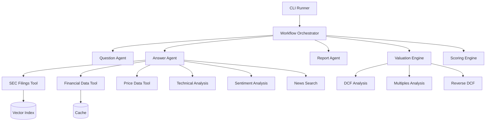

# 🚀 DeepResearch: AI-Powered Financial Analysis Platform

> **🌟 This project has been migrated to GitHub: [valuation100x](https://github.com/nocommitmentsyet/valuation100x)**
> **Complete system available in `/backend/` folder with major enhancements**

A comprehensive multi-agent stock research platform that combines SEC filings analysis, financial data, technical indicators, sentiment analysis, and valuation modeling to generate professional investment reports with automated scoring.

## 📍 **NEW REPOSITORY LOCATION**

**DeepResearch** is now available at: **[https://github.com/nocommitmentsyet/valuation100x](https://github.com/nocommitmentsyet/valuation100x)**

### ✨ **Major Enhancements in GitHub Repository:**
- 🧠 **Aswath Damodaran's Story-Driven Valuation** (complete 6-phase methodology)
- 🌐 **FastAPI Server** with WebSocket support for real-time analysis
- 🐳 **Docker Deployment** with Redis caching for production
- 📊 **Three-Tier Analysis**: Core → Damodaran → Enhanced
- 🎯 **Frontend Integration Ready** with complete API specifications

## 🎯 Overview

This system automates the entire equity research process using AI agents and multiple data sources:

- **📊 Comprehensive Data Integration**: SEC filings, financial statements, price data, news, and analyst research
- **🤖 Multi-Agent Architecture**: Specialized agents for question generation, research, and reporting
- **📈 Advanced Valuation**: DCF scenarios, reverse DCF, multiples analysis, and ensemble methodologies
- **🎯 Investment Scoring**: 1-10 scale scoring with component breakdown (valuation, quality, sentiment, technicals)
- **📝 Professional Reports**: Markdown-formatted investment reports with citations and recommendations

## 🏗️ Architecture



## 📋 Features

### 🔍 **Research Capabilities**
- **SEC Filings Analysis**: 10-K, 10-Q, earnings transcripts with semantic search
- **Financial Data**: Income statements, balance sheets, cash flows, ratios
- **Market Data**: Historical prices, technical indicators, volatility metrics
- **Sentiment Analysis**: FinBERT-powered earnings call and news sentiment
- **News & Research**: Recent articles, analyst reports, price targets

### 💰 **Valuation & Scoring**
- **DCF Scenarios**: Bear/base/bull case modeling with sector-specific WACC
- **Reverse DCF**: Implied growth rates from current market pricing
- **Multiples Analysis**: P/E, P/S, EV/EBITDA with sector benchmarks
- **Quality Scoring**: ROE, debt ratios, profitability, liquidity metrics
- **Technical Scoring**: RSI, moving averages, momentum, drawdown analysis

### 📊 **Output & Reporting**
- **Investment Score**: 1-10 scale (1=overvalued, 10=undervalued) with component breakdown
- **Professional Reports**: Executive summary, valuation, drivers, risks, conclusion
- **Multiple Formats**: JSON data + Markdown reports with citations
- **Batch Processing**: Analyze multiple stocks with configurable concurrency

## 🛠️ Installation

### Prerequisites
- **Python 3.10+**
- **API Keys**: OpenAI, Tavily, FMP, Alpha Vantage/Polygon, SEC-API
- **Memory**: 8GB+ RAM recommended for embeddings
- **Storage**: 2GB+ for cached data and indexes

### Quick Start

1. **Clone and Setup**
```bash
git clone <repository-url>
cd deepresearch
pip install -r requirements.txt
```

2. **Configure Environment**
```bash
# Copy template and add your API keys
cp env.template .env

# Edit .env with your API keys
OPENAI_API_KEY=your_openai_key_here
TAVILY_API_KEY=your_tavily_key_here
FMP_API_KEY=your_fmp_key_here
ALPHAVANTAGE_API_KEY=your_alpha_vantage_key_here
POLYGON_API_KEY=your_polygon_key_here
SEC_API_KEY=your_sec_api_key_here
BLOOMBERG_API_KEY=your_bloomberg_key_here  # Optional
```

3. **Run Analysis**
```bash
# Quick analysis (uses cached/existing data)
python run.py --tickers AAPL

# Full pipeline with data ingestion
python run.py --tickers AAPL,MSFT --ingest --build-index
```

## 🔧 API Keys Setup

### Required APIs

| Service | Purpose | Cost | Setup |
|---------|---------|------|-------|
| **OpenAI** | LLM agents, embeddings | ~$0.50/stock | [platform.openai.com](https://platform.openai.com) |
| **Tavily** | News & web search | ~$0.10/stock | [tavily.com](https://tavily.com) |
| **FMP** | Financial data | Free tier available | [financialmodelingprep.com](https://financialmodelingprep.com) |

### Optional APIs

| Service | Purpose | Alternative |
|---------|---------|-------------|
| **Alpha Vantage** | Price data | Polygon.io |
| **Polygon.io** | Price data | Alpha Vantage |
| **SEC-API** | SEC filings | Manual download |
| **Bloomberg** | Premium data | Stub implementation |

## 📖 Usage

### Basic Analysis
```bash
# Analyze a single stock
python run.py --tickers AAPL

# Analyze multiple stocks
python run.py --tickers AAPL,MSFT,GOOGL --concurrency 2
```

### Full Pipeline
```bash
# Complete pipeline: ingest → index → analyze
python run.py --tickers AAPL,MSFT \
  --ingest \
  --build-index \
  --years 3 \
  --concurrency 2
```

### Data Management
```bash
# Check cache status
python run.py --cache-stats

# Clear cache
python run.py --clear-cache

# Rebuild indexes
python run.py --tickers AAPL --build-index --force-rebuild
```

### Workflow Testing
```bash
# Generate workflow diagram
python workflow.py --draw-workflow

# Test individual components
python agents/questions.py --ticker AAPL
python agents/answer.py --ticker AAPL --question "What are the key growth drivers?"
```

## 📁 Project Structure

```
deepresearch/
├── 📁 agents/                    # AI agents
│   ├── questions.py              # Question generation agent
│   ├── answer.py                 # Research agent with tools
│   └── report.py                 # Report generation agent
├── 📁 tools/                     # Research tools
│   ├── retrieval.py              # SEC filings search
│   ├── fmp.py                    # Financial data (FMP)
│   ├── alpha.py                  # Price data (Alpha Vantage)
│   ├── polygon.py                # Price data (Polygon)
│   ├── technicals.py             # Technical indicators
│   ├── sentiment.py              # Sentiment analysis
│   ├── news.py                   # News search
│   ├── bloomberg.py              # Bloomberg stub
│   └── cache.py                  # Caching system
├── 📁 ingestion/                 # Data ingestion
│   ├── sec_ingest.py             # SEC filings downloader
│   └── embed_index.py            # Vector index builder
├── 📁 synthesis/                 # Analysis engines
│   ├── valuation.py              # Valuation models
│   ├── scoring.py                # Investment scoring
│   └── 📁 tests/                 # Unit tests
├── 📁 configs/                   # Configuration
│   └── scoring.yaml              # Scoring parameters
├── 📁 data/                      # Data storage
│   ├── 📁 filings_raw/          # Raw SEC filings
│   ├── 📁 index/                # Vector indexes
│   ├── 📁 cache/                # API cache
│   └── 📁 outputs/              # Analysis results
├── workflow.py                   # Main workflow orchestrator
├── run.py                       # CLI runner
└── requirements.txt             # Dependencies
```

## 🎛️ Configuration

### Scoring Parameters (`configs/scoring.yaml`)

```yaml
# Sector-specific WACC ranges
sector_wacc:
  technology: [8.0, 12.0]
  healthcare: [7.5, 10.5]
  financials: [8.0, 11.0]

# Scoring weights
scoring_weights:
  valuation: 0.40    # DCF, multiples, reverse DCF
  quality: 0.25      # Financial ratios, balance sheet
  sentiment: 0.20    # Earnings calls, news sentiment
  technicals: 0.15   # Price momentum, indicators

# Quality thresholds
quality_thresholds:
  roe_excellent: 0.20
  debt_to_equity_low: 0.30
  current_ratio_good: 1.50
```

### Data Sources Priority

**Price Data**:
1. Polygon.io (primary)
2. Alpha Vantage (fallback)
3. FMP profile data (last resort)

**Financial Data**:
1. Financial Modeling Prep (comprehensive)
2. Bloomberg API (if configured)

## 📊 Output Examples

### Investment Score Breakdown
```
📊 Analysis Results for Apple Inc. (AAPL):
Investment Score: 7.2/10
Fair Value: $185.50
Current Price: $150.25
Probability Undervalued: 75%

Component Scores:
  Valuation: 8.5/10
  Quality: 7.8/10
  Sentiment: 6.0/10
  Technicals: 6.5/10
```

### Generated Files
- **JSON Results**: `data/outputs/AAPL/AAPL_analysis.json`
- **Markdown Report**: `data/outputs/AAPL/AAPL_report.md`
- **Pipeline Summary**: `data/outputs/pipeline_results.json`

## 🔧 Customization

### Adding New Data Sources

1. **Create Tool** (`tools/your_source.py`):
```python
async def get_your_data(ticker: str) -> Dict[str, Any]:
    # Your implementation
    return data
```

2. **Add to Answer Agent** (`agents/answer.py`):
```python
def _create_your_tool(self) -> FunctionTool:
    async def your_tool_function(ticker: str) -> str:
        data = await get_your_data(ticker)
        return json.dumps(data)
    
    return FunctionTool.from_defaults(fn=your_tool_function)
```

### Custom Valuation Models

Extend `ValuationEngine` in `synthesis/valuation.py`:

```python
def your_valuation_method(self, financial_data: Dict) -> Dict:
    # Your valuation logic
    return valuation_result
```

### Sector-Specific Configurations

Add to `configs/scoring.yaml`:

```yaml
sector_wacc:
  your_sector: [min_wacc, max_wacc]

custom_thresholds:
  your_sector:
    custom_metric: threshold_value
```

## 🧪 Testing

```bash
# Run unit tests
python -m pytest synthesis/tests/ -v

# Test individual components
python synthesis/tests/test_valuation.py
python synthesis/tests/test_scoring.py

# Test workflow
python workflow.py --ticker AAPL --company "Apple Inc."
```

## 📈 Performance & Scaling

### Typical Analysis Times
- **Single Stock**: 2-5 minutes
- **Batch (5 stocks)**: 8-15 minutes
- **With Ingestion**: +5-10 minutes per stock

### Memory Usage
- **Base System**: ~500MB
- **Per Stock Index**: ~50-100MB
- **Concurrent Analysis**: +200MB per stock

### Optimization Tips
1. **Use caching** for repeated analyses
2. **Limit concurrency** based on API rate limits
3. **Pre-build indexes** for faster analysis
4. **Monitor API costs** with batch processing

## 🚨 Limitations & Disclaimers

### Current Limitations
- **Bloomberg Integration**: Stub implementation (requires Terminal/API license)
- **Real-time Data**: Most sources have 15+ minute delays
- **Alternative Data**: No satellite, credit card, or social media data
- **Backtesting**: No historical strategy testing framework

### Investment Disclaimer
⚠️ **This system is for educational and research purposes only. All analysis results should be verified independently. Past performance does not guarantee future results. Always conduct your own due diligence before making investment decisions.**

### Data Accuracy
- Financial data accuracy depends on third-party APIs
- SEC filings may have parsing errors
- Sentiment analysis is algorithmic and may miss context
- Technical indicators are based on historical patterns

## 🛟 Troubleshooting

### Common Issues

**🔑 API Key Errors**
```bash
# Check your .env file
cat .env | grep API_KEY

# Test individual APIs
python tools/fmp.py --ticker AAPL
python tools/alpha.py --ticker AAPL --prices
```

**💾 Memory Issues**
```bash
# Reduce concurrency
python run.py --tickers AAPL,MSFT --concurrency 1

# Clear cache
python run.py --clear-cache
```

**🐛 Analysis Failures**
```bash
# Enable verbose logging
python run.py --tickers AAPL --verbose

# Check logs
tail -f logs/stock_research.log
```

**📊 Missing Data**
```bash
# Rebuild indexes
python run.py --tickers AAPL --build-index --force-rebuild

# Re-ingest filings
python run.py --tickers AAPL --ingest --years 2
```

### Performance Tuning

**Rate Limits**:
- SEC API: 10 requests/minute
- Alpha Vantage: 5 requests/minute (free)
- FMP: 300 requests/minute
- Polygon: 50 requests/minute

**Caching Strategy**:
- Financial data: 24 hours
- Price data: 24 hours  
- SEC filings: Permanent until refresh
- News: 4 hours

## 🤝 Contributing

1. **Fork** the repository
2. **Create** a feature branch (`git checkout -b feature/amazing-feature`)
3. **Add tests** for new functionality
4. **Commit** changes (`git commit -m 'Add amazing feature'`)
5. **Push** to branch (`git push origin feature/amazing-feature`)
6. **Open** a Pull Request

### Development Setup
```bash
# Install development dependencies
pip install -r requirements.txt
pip install pytest black flake8

# Run code formatting
black .

# Run linting
flake8 .

# Run tests
pytest synthesis/tests/ -v
```

## 📜 License

This project is licensed under the MIT License - see the [LICENSE](LICENSE) file for details.

## 🔮 Roadmap

### Phase 1 (Current)
- ✅ Multi-agent research system
- ✅ SEC filings analysis
- ✅ Comprehensive valuation models
- ✅ Investment scoring framework

### Phase 2 (Planned)
- 🔄 Bloomberg Terminal integration
- 🔄 Real-time data feeds
- 🔄 Portfolio-level analysis
- 🔄 Risk management metrics

### Phase 3 (Future)
- 📋 Alternative data sources
- 📋 Backtesting framework
- 📋 Strategy optimization
- 📋 Web dashboard interface

## 📞 Support

- **Documentation**: This README + inline code comments
- **Issues**: Use GitHub Issues for bug reports and feature requests
- **Discussions**: Use GitHub Discussions for questions and ideas

---

**Built with ❤️ using LlamaIndex, OpenAI, and Python**

*Last updated: January 2024*
